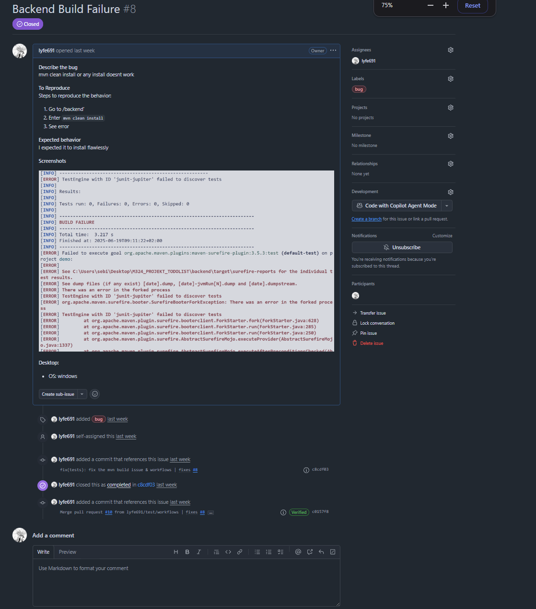
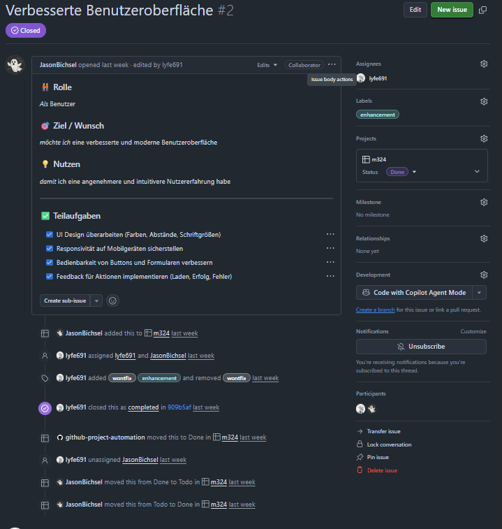
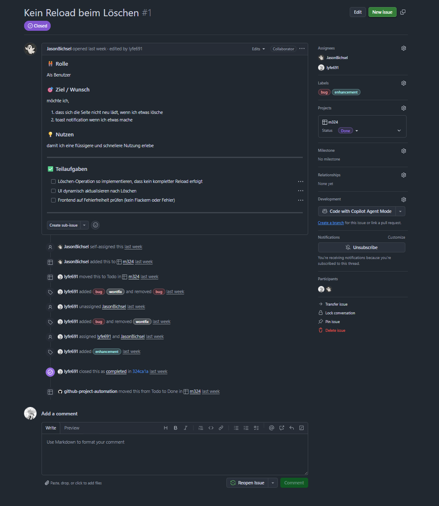

# Dokumentation – m324 SideQuest 2b

---

**Team:**

* Yanis Sebastian Zürcher
* Jason Bichsel
* Dominik Könitzer

---

### Aufgabe

Es sollten sinnvolle und realistische Erweiterungen für die bestehende TODO-App überlegt und als **User Stories** in GitHub-Issues dokumentiert und umgesetzt werden. Die Stories sollten jeweils den Mehrwert für den Benutzer klar machen und über definierte Akzeptanzkriterien verfügen.

---

### Umgesetzte User Stories

#### [Backend Build Failure (#8)](https://github.com/lyfe691/M324_PROJEKT_TODOLIST/issues/8)



**User Story:**
Als Entwickler möchte ich, dass der Backend-Build zuverlässig funktioniert, damit ich effizient neue Features entwickeln kann.

**Akzeptanzkriterien:**

* Das Projekt kann nach einem `mvn clean install` fehlerfrei gebaut werden.
* Alle JUnit-Tests laufen stabil und ohne Forking-Fehler.

**Lösung:**
Ein Build-Fehler durch die Surefire-Plugin-Konfiguration wurde identifiziert und behoben. Der Fehler trat aufgrund einer fehlerhaften Testumgebung auf. Nach Anpassung der Testkonfiguration und Cleanup des Projekts (`target/`) wurde das Problem vollständig gelöst.

---

#### [Verbesserte Benutzeroberfläche (#2)](https://github.com/lyfe691/M324_PROJEKT_TODOLIST/issues/2)



**User Story:**
Als Benutzer möchte ich eine verbesserte und moderne Benutzeroberfläche, damit die Nutzung angenehmer und intuitiver ist.

**Akzeptanzkriterien:**

* Das Design wirkt aufgeräumt und einheitlich.
* Die Oberfläche ist responsiv und funktioniert auf verschiedenen Geräten.
* Buttons und Formulare sind besser bedienbar.
* Feedback bei Aktionen (Laden, Erfolg, Fehler) ist klar erkennbar.

**Lösung:**
Die UI wurde umfassend überarbeitet: Abstände und Schriftgrössen wurden optimiert, Buttons und Formulare benutzerfreundlicher gestaltet und interaktive Statusanzeigen hinzugefügt. Die Oberfläche ist nun responsiv und bietet konsistentes Feedback. Es wurde auch noch react-hot-toast hinzugefügt, um die Nutzererfahrung zu verbessern.

---

#### [Kein Reload beim Löschen (#1)](https://github.com/lyfe691/M324_PROJEKT_TODOLIST/issues/1)



**User Story:**
Als Benutzer möchte ich, dass die Seite sich beim Löschen eines Todos nicht neu lädt, damit die Nutzung flüssiger ist.

**Akzeptanzkriterien:**

* Löschvorgänge verursachen keinen vollständigen Reload.
* Die UI aktualisiert sich dynamisch.
* Fehlerfälle werden klar angezeigt.

**Lösung:**
Das Löschen eines Todos wurde überarbeitet: Statt eines Reloads erfolgt jetzt eine dynamische Aktualisierung der Oberfläche via State Management. Zusätzlich wurde eine Fehlerbehandlung im Frontend eingebaut, die dem Nutzer Rückmeldung bei Problemen gibt.

---

### Wissens-Check

**Wie sind User Stories aufgebaut?**
User Stories folgen dem Format:
*Als \[Rolle] möchte ich \[Ziel/Wunsch], damit \[Nutzen].*

EG: 
```	
	name: 🧩 User Story
	about: Erstelle eine neue User Story
	title: "[User Story] "
	labels: user-story
	assignees: ''
	---
	### 🧑‍🤝‍🧑 Rolle
	*Als* ... *(z. B. Benutzer, Admin, Entwickler)*
	### 🎯 Ziel / Wunsch
	*möchte ich* ...
	### 💡 Nutzen
	*damit* ...
	---
	### ✅ Teilaufgaben
	- [ ] Task 1
	- [ ] Task 2
	- [ ] Task 3
	---
	### 📎 Weitere Hinweise
	(Optional: Screenshots, Links, technische Hinweise …)
```

Dazu gehören Akzeptanzkriterien, die definieren, wann die Story als erledigt gilt.

**Warum werden User Stories nicht schon zu Beginn des Projekts ganz genau definiert?**
Weil Anforderungen sich im Laufe des Projekts ändern können. User Stories sollen flexibel bleiben und inkrementell erweitert oder angepasst werden, basierend auf Feedback und realen Nutzerbedürfnissen.

---

### Hinweis

Es wurden bereits weitere User Stories in Form von Issues auf GitHub erstellt und dokumentiert. Siehe: [GitHub Issues Übersicht](https://github.com/lyfe691/M324_PROJEKT_TODOLIST/issues)

---
