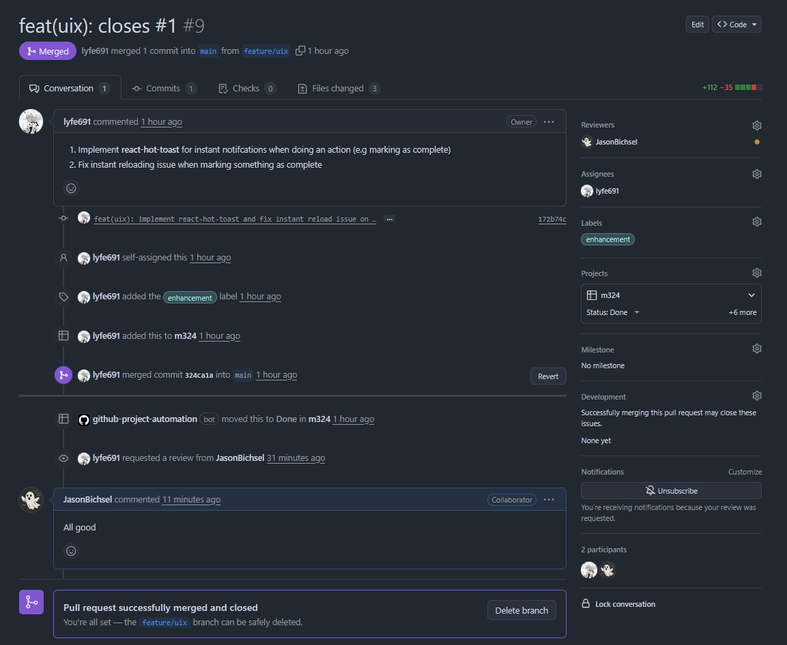
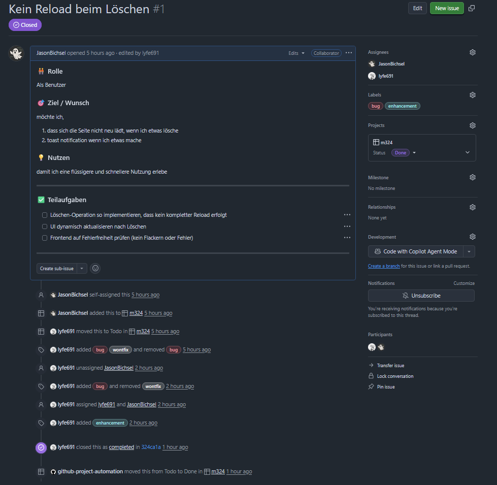

# Dokumentation – m324 SideQuest 3b

---

**Team:**
- Yanis Sebastian Zürcher
- Jason Bichsel
- Dominik Könitzer

---

## 1. Lokale Umsetzung
 
### 1.1 Branch erstellen
 
```bash
git checkout -b feature/uix
```
 
**Output:**
 
```
Switched to a new branch 'feature/uix'
```
 
### 1.2 Änderungen hinzufügen
 
```bash
git add .
```
 
### 1.3 Commit mit Nachricht
 
```bash
git commit -m "feat(uix): implement react-hot-toast and fix instant reload issue on delete"
```
 
**Output:**
 
```
[feature/uix 172b74c] feat(uix): implement react-hot-toast and fix instant reload issue on delete
 3 files changed, 112 insertions(+), 35 deletions(-)
```
 
### 1.4 Branch-Status anzeigen
 
```bash
git branch -v
```
 
**Output:**
 
```
* feature/uix 172b74c feat(uix): implement react-hot-toast and fix instant reload issue on delete
  main        f24e461 feat(ui): rm mui; await shadcn/ui
```
 
### 1.5 Änderungen pushen
 
```bash
git push -u origin feature/uix
```
 
**Output:**
 
```
Enumerating objects: 13, done.
Counting objects: 100% (13/13), done.
Delta compression using up to 16 threads
Compressing objects: 100% (7/7), done.
Writing objects: 100% (7/7), 1.85 KiB | 1.85 MiB/s, done.
Total 7 (delta 5), reused 0 (delta 0), pack-reused 0 (from 0)
remote: Resolving deltas: 100% (5/5), completed with 5 local objects.
remote:
remote: Create a pull request for 'feature/uix' on GitHub by visiting:
remote:      https://github.com/lyfe691/M324_PROJEKT_TODOLIST/pull/new/feature/uix
remote:
To https://github.com/lyfe691/M324_PROJEKT_TODOLIST.git
 * [new branch]      feature/uix -> feature/uix
branch 'feature/uix' set up to track 'origin/feature/uix'.
```
 
---
 
## 2. GitHub
 
### 2.1 Pull Request
 
Anschliessend erstellte Yanis die folgende Pull Request:
 
 

<small>**Abbildung 1:** Merge der Pull Request auf GitHub</small>
 
### 2.2 Issue-Prüfung
 
Jason's Aufgabe war es, die Pull Request zu überprüfen und zu testen. Dafür habe er das zugehörige Issue geprüft:
 
 

<small>**Abbildung 2:** Das zugehörige Issue, welches durch die Pull Request gelöst wird</small>
 
---