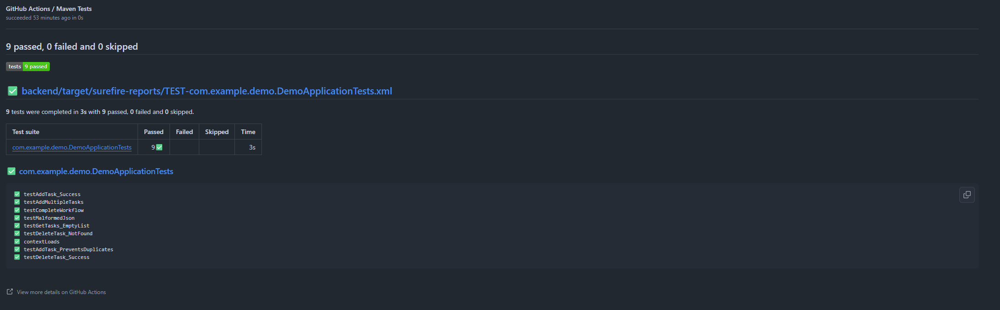
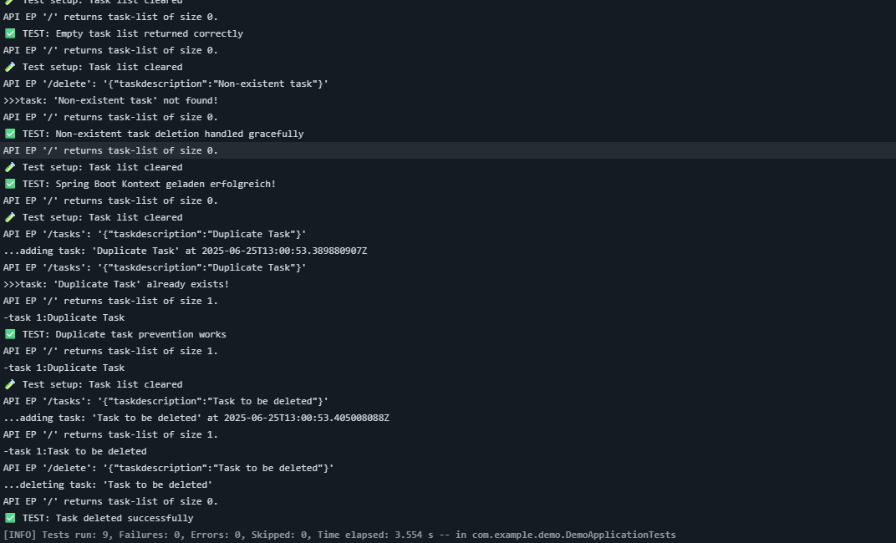

# Dokumentation – m324 SideQuest 4a

**Test Driven Development (TDD) mit Spring Boot & MockMvc**

**Team:**
- Yanis Sebastian Zürcher
- Jason Bichsel
- Dominik Könitzer
---

**Test-Verzeichnis:** [Java test file](https://github.com/lyfe691/M324_PROJEKT_TODOLIST/blob/main/backend/src/test/java/com/example/demo/DemoApplicationTests.java)

---

### 1. Ausgangslage & Ziel der Aufgabe

Ziel war es, für das bestehende Backend mindestens einen Unit-Test zu schreiben, mit dem Tooling (`mvn test`) auszuführen und anschliessend mithilfe von TDD neue Funktionalitäten testgetrieben zu implementieren.
Dabei sollten folgende Grundprinzipien berücksichtigt werden:

* Jeder Test ist automatisiert ausführbar
* Der erste Test schlägt fehl → Implementierung → Test besteht
* Tests sichern bestehende Funktionalitäten
* Es soll sinnvoll, nicht künstlich, erweitert werden

---

### 2. Test Setup

#### Test-Frameworks:

* `JUnit 5`
* `Spring Boot Test`
* `MockMvc` für Endpunktprüfung
* `ObjectMapper` für JSON-Handling

#### Beispielhafter Testaufbau:

```java
@BeforeEach
void setUp() {
    demoApplication.getTasks().clear(); // Testisolation
}
```

Alle Tests werden zentral über `DemoApplicationTests` ausgeführt.

---

### 3. Implementierte Tests

Insgesamt wurden **9 Tests** geschrieben, die über `mvn test` erfolgreich ausgeführt wurden ([Beweis](https://github.com/lyfe691/M324_PROJEKT_TODOLIST/actions/runs/15877048320/job/44767144077)):

#### Übersicht:

| Testname                        | Funktion                                                 |
| ------------------------------- | -------------------------------------------------------- |
| contextLoads                    | Überprüft, ob Spring Boot korrekt startet                |
| testGetTasks\_EmptyList         | GET `/` gibt leere Liste zurück                          |
| testAddTask\_Success            | POST `/tasks` fügt korrekt neue Aufgabe hinzu            |
| testAddTask\_PreventsDuplicates | Doppelte Aufgaben werden abgefangen                      |
| testAddMultipleTasks            | Mehrere Aufgaben werden korrekt aufgenommen              |
| testDeleteTask\_Success         | Aufgaben lassen sich gezielt löschen                     |
| testDeleteTask\_NotFound        | Löschen nicht-existenter Aufgaben führt nicht zu Fehlern |
| testCompleteWorkflow            | Mehrstufiger Workflow: hinzufügen, löschen, validieren   |
| testMalformedJson               | Ungültiges JSON wird abgefangen ohne Crash               |

#### Beispiel für einen GET-Test mit MockMvc:

```java
mockMvc.perform(get("/"))
    .andExpect(status().isOk())
    .andExpect(jsonPath("$", hasSize(0)));
```

#### Beispiel für POST mit Validierung:

```java
mockMvc.perform(post("/tasks")
    .contentType(MediaType.APPLICATION_JSON)
    .content("{\"taskdescription\":\"Learn Spring Boot Testing\"}"))
    .andExpect(status().isOk())
    .andExpect(content().string("redirect:/"));
```

---

### 4. Test Driven Development (TDD) Anwendung

**Beispielhafter Ablauf:**

* Neuer Test wurde zuerst für eine neue Funktion geschrieben (z. B. Duplikate verhindern)
* Test schlug erwartungsgemäss fehl → Implementierung angepasst
* Test wurde erfolgreich bestanden

Die TDD-Schritte (Red → Green → Refactor) wurden mehrfach durchgeführt.

---

### 5. Ergebnis / Testlauf

#### Maven Logauszug:

```
[INFO] Tests run: 9, Failures: 0, Errors: 0, Skipped: 0
[INFO] BUILD SUCCESS
```

Alle Tests wurden in **GitHub Actions** automatisiert validiert und bestanden.



oder via terminal output: 



---

### 6. Codequalität und Refactoring

* Methoden sind klar benannt
* Setup erfolgt per `@BeforeEach`
* Kein duplizierter Code (DRY)
* Trennung von Testdaten und Assertions
* Struktur klar und wartbar

---

### 7. Herausforderungen

* Korrektes Setup von `MockMvc`
* Fehlerhandling für ungültige JSON-Nachrichten (Jackson)
* Reihenfolge von Tests beachten wegen Zustandsabhängigkeit

---

### 8. Upload & Versionskontrolle

Der Code wurde über GitHub aktualisiert und ist versionskontrolliert im Repository sichtbar.
Branches wurden verwendet, um parallele Arbeit im Team zu ermöglichen.

---

### 9. Fazit zur Aufgabe

Die Aufgabe hat gezeigt, wie wirkungsvoll **testgetriebene Entwicklung** sein kann:

* Fehler frühzeitig erkennen
* Verlässlichkeit steigt
* Refactoring ist einfacher
* Änderungen sind nachvollziehbar und dokumentiert

---

### 10. Hausaufgabe – TDD Vor- und Nachteile (Zusammenfassung)

| Vorteile                           | Nachteile                                                |
| ---------------------------------- | -------------------------------------------------------- |
| Frühzeitige Fehlererkennung        | Initial höherer Aufwand                                  |
| Bessere Codequalität & Wartbarkeit | Erfordert Disziplin und Erfahrung                        |
| Dokumentation durch Tests          | Schwierig bei UI-/Frontend-lastigen Projekten            |
| Geringeres Risiko bei Refactorings | Langsame Iteration, wenn Tests schlecht geschrieben sind |
